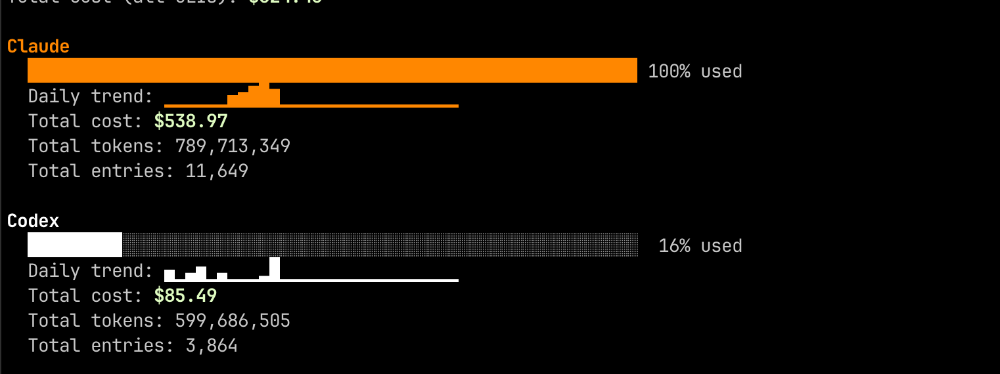

# agents-usage

`agents-usage` is a lightweight terminal dashboard for local AI CLI usage.

It auto-detects logs, summarizes monthly usage, and renders compact terminal charts for:

- Claude Code
- Codex

## Screenshot



## Quick start

Run without installing:

```bash
npx agents-usage
```

or:

```bash
bunx agents-usage
```

Install globally:

```bash
npm install -g agents-usage
agents-usage
```

## Options

```text
Usage: agents-usage [options]

  -s, --sources <list>    Comma list: claude,codex
  -m, --month <YYYY-MM>   Month to chart
      --metric <name>     cost | tokens
      --offline           Do not fetch remote pricing data
      --no-color          Disable ANSI colors
      --non-interactive   Skip prompts (uses flags/defaults)
  -h, --help              Show help
```

## Examples

```bash
agents-usage --non-interactive --month 2026-02
agents-usage --sources claude,codex --month 2026-02 --metric cost --non-interactive
agents-usage --sources codex --month 2026-02 --metric tokens --offline --non-interactive
```

## Notes

- By default, it uses the current month and `cost` metric.
- If pricing cannot be loaded, unknown model pricing is treated as `$0.00` and flagged.

## Author

- Aayush Pokharel: <https://github.com/Aayush9029>
